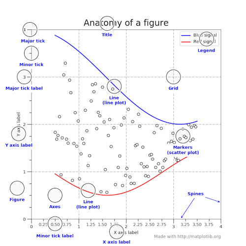
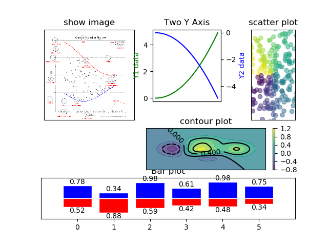
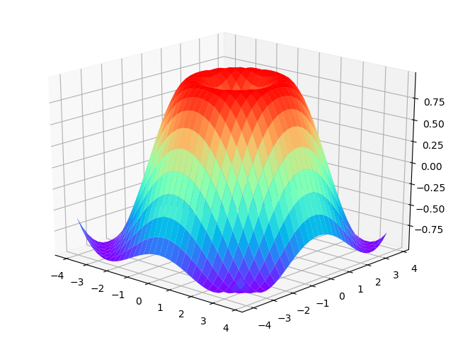
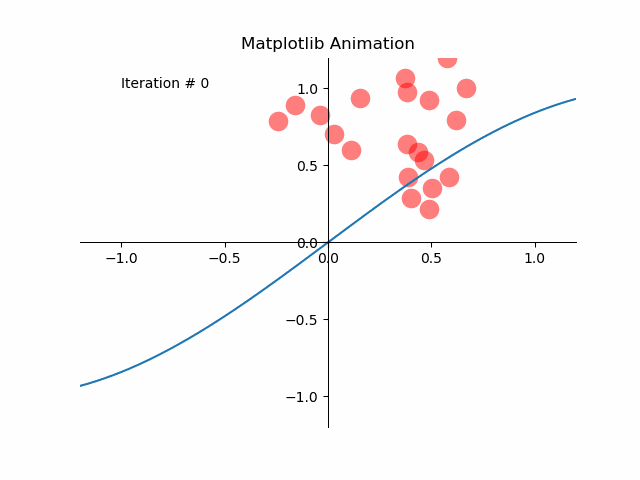

# Matplotlib Examples

## Basic Plot
##### Naming of different parts


##### Example
```
>> basicplot.py
```


## Subplot
##### Example
```
>> subplots.py
```




## 3D Plot
##### Example
```
>> 3dplot.py
```




## Matlab Animation
##### Interactive Mode
```
>> ion_plot.py

plt.figure()
plt.ion()
...
plt.ioff()
plt.show()
```

##### Using Matlab Animation Library
```
>> animation.py
```

